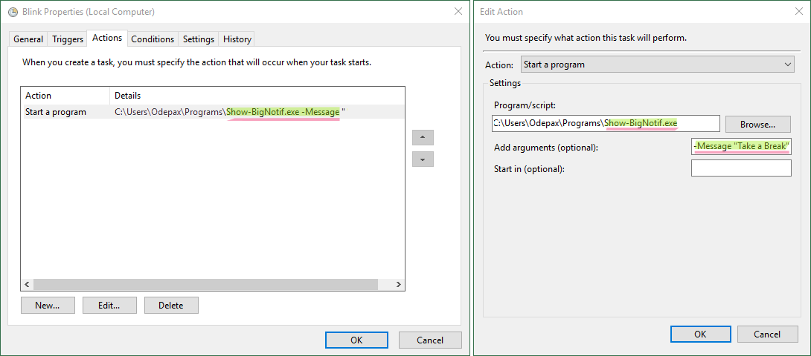

# Big Notif

A full screen notification toast, for those who easily miss their reminders.
I usually use it in combination with the Task Scheduler:



## Usage

### With the Windows Tasks Scheluder

See [Screenshots/Task-Scheduler-Example](./Screenshots/Task-Scheduler-Example)
for the steps to configure a reminder using the Tasks Scheluder.

### From the Command Line

The program will display whatever is the first command-line argument passed to it.

```ps1
C:\Path\To\Show-BigNotif.exe "Jerry, get a job"
C:\Path\To\Show-BigNotif.exe -Message "Jerry, get a job"
```

## TODO

- [x] new font
- [x] license
- [x] real local hour
- [x] Random bg
- [x] message from command line
- [x] Github link
- [x] get rid of the hyperlink (not the link, just the <Hyperlink />)
- [x] better way to quit
- [x] prod build
- [x] task scheduler sceenshots
- [x] readme
- [ ] release 1.0.0

## Font Credit

[Alegreya Sans](https://github.com/huertatipografica/Alegreya-Sans),
see also [Huerta Tipografica](https://www.huertatipografica.com).
